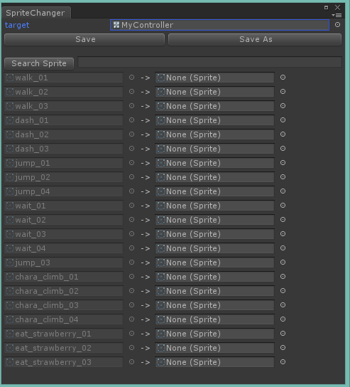

# SpriteChanger
Replace Sprites And AnimationClips In AnimatorController For Unity.

1. Open Window. Windows -> SpriteChanger
1. Select target AnimatorController
1. Set Replace Sprites.
Manually or Search Sprite(Choose Folder To Search Same Name Sprite)
1. Save!

